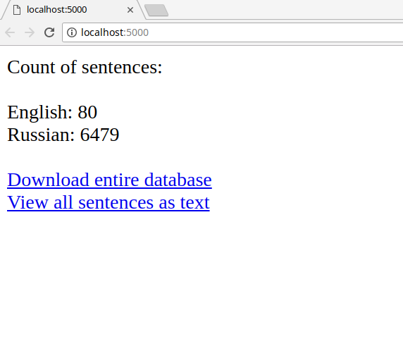

# ner-store

Simple [Flask](http://flask.pocoo.org/) server that serves for storing sentences which were generated by [ner-tagger](https://github.com/livelace/ner-tagger). Database ([SQLite](https://www.sqlite.org)) schema is very simple:

```sql
CREATE TABLE records (
        id INTEGER PRIMARY KEY NOT NULL,
        text TEXT NOT NULL,
        language TEXT NOT NULL,
        url TEXT NOT NULL,
        timestamp INTEGER NOT NULL
    )
```

#### Screenshot:

